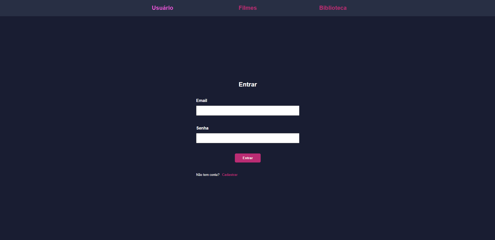

# React-Js--Implementando-supabase-auth-youtube

  

## Youtube

  
  

## Installation

  1. `$ npm install` or `$ yarn`
  2. `$ npm start` or `$ yarn start`

## Functionalities

  + Login
  + Register
  + update user_metadata to store the movies in the library
  
## Used Libraries

 + `supabase-js`
 + `sass`
 + `react-toastify`
